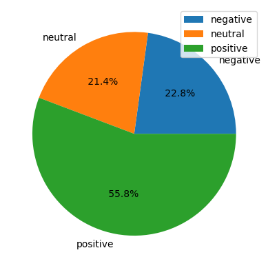

# Sentimen Analisis Calon Presiden


## H. Ganjar Pranowo, S.H., M.I.P.
- ### Sentiments
- 
- ### Wordcloud
- 
- ### Positive Wordcloud
- 
- ### Neutral Wordcloud
- 
- ### Negative Wordcloud
- 

## Letnan Jenderal TNI (Purn.) H. Prabowo Subianto Djojohadikusumo
- ### Sentiments
- 
- ### Wordcloud
- 
- ### Positive Wordcloud
- 
- ### Neutral Wordcloud
- 
- ### Negative Wordcloud
- 

## H. Anies Rasyid Baswedan, S.E., M.P.P., Ph.D
- ### Sentiments
- 
- ### Wordcloud
- 
- ### Positive Wordcloud
- 
- ### Neutral Wordcloud
- 
- ### Negative Wordcloud
- 

## Tools
- Python
- Google Collab
- VADER
- Sastrawi
- NLTK

## Try
```
git clone
Buka google collab
Upload file jupyter notebook dari masing masing capres
Upload slangwords.txt dan stopwords.txt yang berada pada package preprocessing
Run masing masing cell dari atas sampai cell terakhir
```

> [!NOTE]
> Manual labeling untuk penghitungan akurasi, jika diperlukan.


